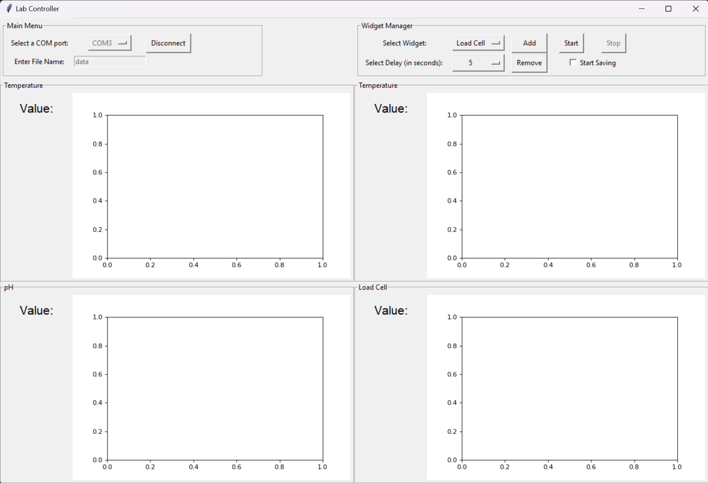

# Lab Controller

###### NOTE: this is not the official repository. Officially not released yet.

This is a lab controller software, this can be used to read multiple sensor readings from arduino and display it on a nice python GUI.

The software can show and read upto 4 sensors at a time.

To learn to use the software refer to the [User Demonstration Video](https://youtu.be/PrluoQlYvcw).

The software is not complete and released yet, this is just for demonstration purposes only.

## Screenshots

 
4 Sensor widgets created in the program for 5 second read delays. 
